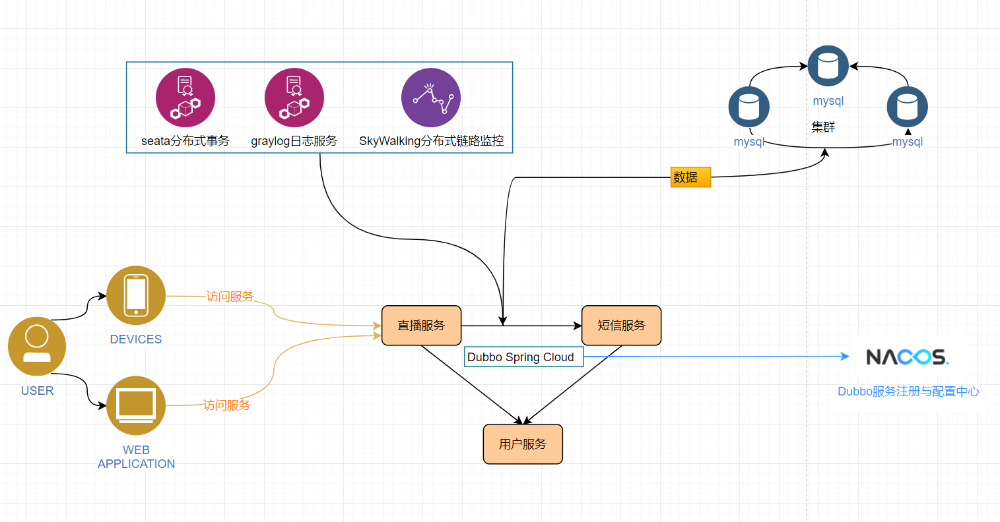

### Dubbo Spring Cloud 学习之旅鸭

> 下面的架构是draw.io绘制



> skywalking时间同步和elasticsearch数据持久化

* 程序包下载：http://skywalking.apache.org/downloads/

修改：H:\apache-skywalking-apm-incubating\agent\config\agent.config collector.backend_service地址

* skywalking

时间同步：TZ: 'Asia/Shanghai'

参考：[docker-compose.yml](docs/skywalking/docker-compose.yml)

需要下载docker依赖：git clone https://github.com/apache/skywalking-docker.git

* elasticsearch

```java
数据持久化
mkdir elasticsearch/data
chmod -R 777 elasticsearch
启动skywalking
docker-compose up -d
```

> war or jar集成skywalking

- Linux Tomcat 7, Tomcat 8  
修改 `tomcat/bin/catalina.sh`,在首行加入如下信息.
```shell
CATALINA_OPTS="$CATALINA_OPTS -javaagent:/path/to/skywalking-agent/skywalking-agent.jar=agent.service_name=Dubbo"; export CATALINA_OPTS
```
- Windows Tomcat 7, Tomcat 8  
修改 `tomcat/bin/catalina.bat`,在首行加入如下信息.
```shell
set "CATALINA_OPTS=-javaagent:/path/to/skywalking-agent/skywalking-agent.jar=agent.service_name=Dubbo"
```
- JAR file  
在启动你的应用程序的命令行中添加 `-javaagent` 参数. 并确保在`-jar`参数之前添加它. 例如:
 ```shell
-javaagent:H:/apache-skywalking-apm-incubating/agent/skywalking-agent.jar=agent.service_name=Dubbo
例如：
java -javaagent:H:/apache-skywalking-apm-incubating/agent/skywalking-agent.jar=agent.service_name=Dubbo -jar dubbo.jar
 ```
 
> 自定义探针配置路径

自定义的探针配置文件内容格式必须与默认探针配置文件内容格式一致，这里所改变的仅仅只是配置文件的路径

**使用方式：使用 `启动参数(-D)` 的方式来设置探针配置文件路径**

```java
-Dskywalking_config=/path/to/agent.config
```

其中的`/path/to/agent.config` 代表的是自定义探针配置文件的绝对路径 

> ipfs

* 安装教程：https://ciweigg2.github.io/2019/05/03/ipfs-fen-bu-shi-wen-jian-cun-chu-xi-tong/


java对接：https://github.com/ipfs/java-ipfs-http-client

Create an IPFS instance with:
```Java
IPFS ipfs = new IPFS("/ip4/127.0.0.1/tcp/5001");
```

To add a file use (the add method returns a list of merklenodes, in this case there is only one element):
```Java
NamedStreamable.FileWrapper file = new NamedStreamable.FileWrapper(new File("hello.txt"));
MerkleNode addResult = ipfs.add(file).get(0);
```

To add a byte[] use:
```Java
NamedStreamable.ByteArrayWrapper file = new NamedStreamable.ByteArrayWrapper("hello.txt", "G'day world! IPFS rocks!".getBytes());
MerkleNode addResult = ipfs.add(file).get(0);
```

To get a file use:
```Java
Multihash filePointer = Multihash.fromBase58("QmPZ9gcCEpqKTo6aq61g2nXGUhM4iCL3ewB6LDXZCtioEB");
byte[] fileContents = ipfs.cat(filePointer);
```

代码中有使用例子的

> 技术栈

* Dubbo Spring Cloud
* Nacos
* Mybatis-plus
* Redis(分布式锁)https://gitee.com/ciweigg/spring-boot-klock-starter.git
* SkyWalking
* seata
* graylog(https://docs.graylog.org/en/3.0/pages/installation/docker.html)
* Mysql
* Docker
* ipfs(https://ciweigg2.github.io/2019/05/03/ipfs-fen-bu-shi-wen-jian-cun-chu-xi-tong/)